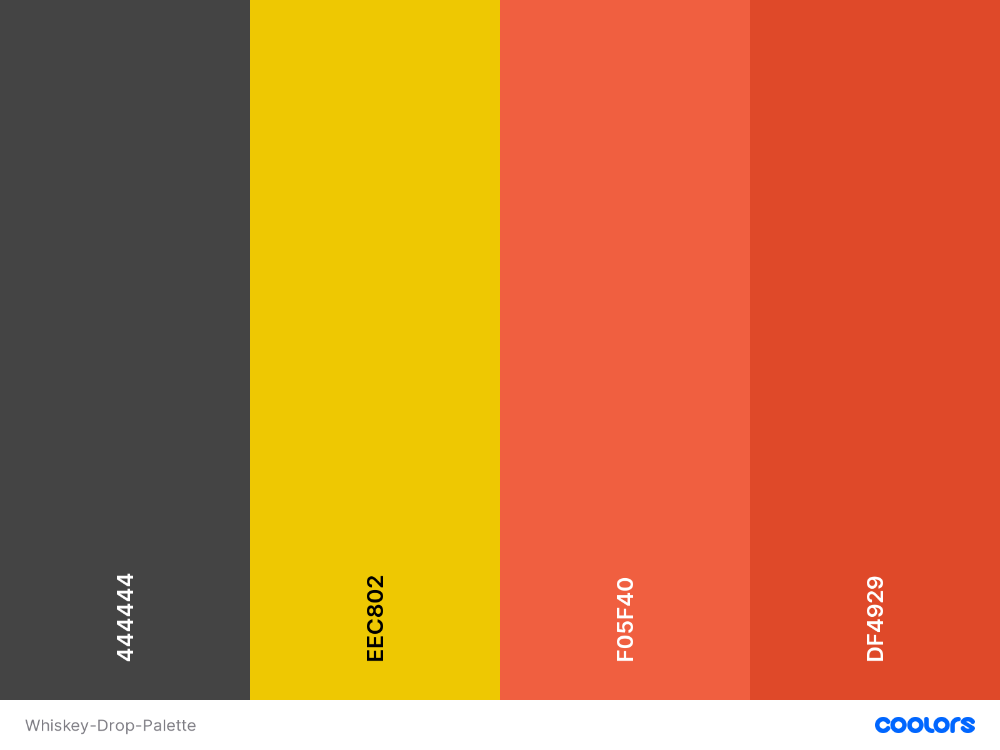

***Whiskey Drop** is a mock landing page for an imaginary product to experiment with Boostrap's core features and to use CSS styling to enhance the look of the Boostrap functionality.
This is part of Module 5 - User Centric Front End for the Full Stack Software Developer Diploma.*

## Contents ##

- [Logo](#img-srcwireframeslogo-imagejpg-altlogo)
  - [Contents](#contents)
  - [UX (User Experience)](#ux-user-experience)
    - [Project Goals](#project-goals)
    - [User Goals](#user-goals)
    - [User Stories](#user-stories)
    - [Site Owner Goals](#site-owner-goals)
    - [User Requirements and Expectations](#user-requirements-and-expectations)
  - [Design Choices](#design-choices)
    - [Fonts](#fonts)
    - [Colours](#colours)
    - [Wireframes](#wireframes)
  - [Technologies](#technologies)
    - [Languages](#languages)
    - [Libraries](#libraries)
    - [Tools](#tools)
  - [Features](#features)
    - [Features Implemented](#features-implemented)
    - [Future Features](#future-features)
  - [Testing](#testing)
  - [Bugs](#bugs)
  - [Deployment](#deployment)
    - [Running CI-Whiskey-Drop-Project Locally](#running-bi-team-5-locally)
  - [Credits](#credits)
    - [Images](#images)
    - [Colour](#colour)
    - [Image editing](#image-editing)
    - [Acknowledgements](#acknowledgements)

## UX (User Experience) ##

## Project Goals ##

The **goal** of this project is to build a website which experiments with Boostrap's core features and to use CSS styling to enhance the look of the Boostrap functionality


## User Goals ##

- **Sign up** for more information about the range of whiskeys on offer.
- **Read** testimonials from previous customers
- **Read** featured articles about related subjects.

## User Stories ##

- As a **user**, I can see a responsive **navbar** with  Home, About and a dropdow menu of different whiskey types on offer.
- As a **user**, I can see a **call-out section** with a call to action (cta) containing a marketing offer and a sign sign up butto.
- As a **user**, I can see a **quotes section** containing images and quotes for happy customers.
- As a **user**, I can see a **features section** containing featured articles with the option of a readme button to see more of each article.

## Site Owner Goals ##

- As a **site owner**, I want to create visually engaging webpage that inspires customers to explore the whiskeys on offer
- As a **site owner**, I want the user to be able to sign up for marketing emails.
- As a **site owner**, I want my users to be able to see customer testimonials.
- As a **site owner**, I want my users to be able to see featured articles and additional content.

## User Requirements and Expectations ##

- **Header**, **Main body** divided into three sections
- In the **Header** we should see a **Logo** and a **navigation bar** on the left side with option to go to:
  - **Home section** (top of the site)
  - **About section** (link not working yet)
  - **Whiskey's section** dropdown menu containing different types of whiskeys available.

- On the right side of the **Header** you should see additional call to action with a slogan and a sign in / sign up button.

- In the **Main body** we should see:
  - **Callout** section with a heaing, call to action and a sign up button
  - **Quotes** section with a header and testimonials from previous customers.
  - **Features** section with a header and features arranged in a card format.
  

  
## Design Choices ##

### Fonts ###

We have chosen [Roboto](https://fonts.google.com/specimen/Roboto) from Google fonts for the entire site.

### Colours ###

We have chosen the colour that enhance and contrast the dark coloured Bootstrap theme that are appealing to the eye and also compliments the design of the project.


- *Onyx* (444444) - Dark Grey
- *Yellow Munsell* (EEC802) - Yellow
- *Orange Soda* (F05F40) - Orange
- *Cinnabar* (DF4929) - Dark Orange

These colours will compliment each other well when used across the site creating pleasant ambience.

### Wireframes ###

We designed our site mock-ups using [balsamiq wireframes](https://balsamiq.com/). We were focusing on defining basic layout structure of the site and identifying how displays would change on different screen sizes such as [mobile](/wireframes/mobile.jpg), [tablet](/wireframes/tablet.jpg) and [desktop](/wireframes/desktop.jpg).

---  

## Technologies ##

### Languages ###

- [HTML](https://developer.mozilla.org/en-US/docs/Web/HTML)
- [CSS](https://developer.mozilla.org/en-US/docs/Web/CSS)

### Libraries ###

- [Bootstrap](https://getbootstrap.com/)

  
### Tools ###

- [Git](https://git-scm.com/)
- [GitHub](https://github.com/)
- [Visual Studio Code](https://code.visualstudio.com/)
- [Font-Awesome](https://fontawesome.com/icons?d=gallery)
- [Google fonts](https://fonts.google.com/)
- [Colour editor](https://coolors.co/)
- [Image editor](https://www.birme.net/)
---

## Features ##

### Features Implemented ###

- Responsive design
- User friendly display
- Navbar with easy navigation
- ...
- ...
- Social media links
  
### Future Features ###

- ...

---

## Testing ##

- Testing information can be found in a separate [testing.md](testing.md) file.

## Bugs ##

For every bug we found while in development process, we have logged an [incident](https://github.com/simonjvardy/CI-Whiskey-Drop-Project/issues) report.
Bug we have managed to fix are now marked as [closed](https://github.com/simonjvardy/CI-Whiskey-Drop-Project/issues?q=is%3Aissue+is%3Aclosed).

## Deployment ##

The website was developed using both *Gitpod* and *Visual Studio Code* and using *Git* pushed to *GitHub*, which hosts the repository. I made the following steps to deploy the site using *GitHub Pages*:

- Opened up **GitHub** in the browser.
- Signed in with my **username** and **password**.
- Selected my **repositories**.
- Navigated to **simonjvardy/[repo name here]**.
- In the top navigation clicked **settings**.
- Scrolled down to the **GitHub Pages** area.
- Selected **Master Branch** from the **Source** dropdown menu.
- Clicked to **confirm** my **selection**.
- CI-Whiskey-Drop-Project(https://simonjvardy.github.io/CI-Whiskey-Drop-Project/) is now **live** on **GitHub Pages**.

### Running CI-Whiskey-Drop-Project Locally ###

Cloning CI-Whiskey-Drop-Project from GitHub:

- Navigate to **simonjvardy/CI-Whiskey-Drop-Project**.
- Click the green **Code** button.
- **Copy** the url in the dropdown box.
- Using your favourite **IDE** open up your preferred terminal.
- **Navigate** to your desired file location.

Copy the following code and input it into your terminal to clone CI-Whiskey-Drop-Project:

```git clone https://github.com/simonjvardy/CI-Whiskey-Drop-Project.git```

---

## Credits ##

### Images ###

You can find the images used for the site [here](assets/images). We have sourced them through the Code Institute course material:

### Image editing ###

- We have used snippet tool for capturing screengrabs which we have saved as images.
- A handy [Birme](https://www.birme.net/?target_width=300&target_height=300&quality=100&border_width=1&border_color=%23bd3d3a) site allowed us to resise the images all at once.

### Acknowledgements ###

- [W3Schools](https://www.w3schools.com/) for just being a constant source of help and inspiration!
- [Code Institute](https://codeinstitute.net/full-stack-software-development-diploma/) Course material for the code-along challenge.
- [Neringa Bickmore](https://github.com/neringabickmore) for her guidance and advice on the README.md and testing.mddocument content and layout.
---
